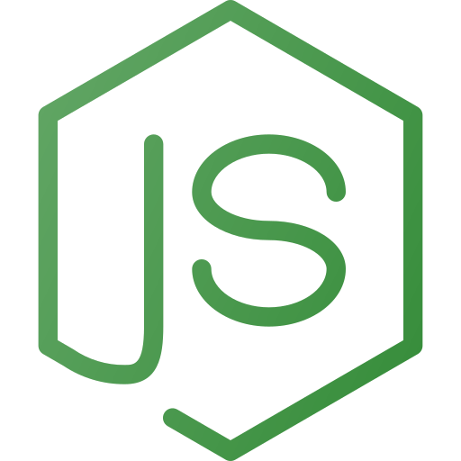

<h1 align="center">Hi 👋, I'm MD Saifur Rahman</h1>
<h3 align="center">A passionate frontend web developer from Bangladesh</h3>

I'm a frontend-based web developer, skillful at designing and developing high-quality websites that play a central role in leading overall business success. In addition to my professional work, I am passionate about self-learning and staying up-to-date with the latest developments in the field.

- 🔭 I’m currently working as a **frontend developer.**

- 🌱 I’m currently learning **MERN stack and NEXT JS.**

- 👨‍💻 All of my projects are available at [https://md-saifur-rahman-portfolio.netlify.app/](https://md-saifur-rahman-portfolio.netlify.app/)

- 📫 How to reach me **saifurrahmansaif954@gmail.com**

- 📄 Know about my experiences [https://mdsaifurrahman-resume.netlify.app/](https://mdsaifurrahman-resume.netlify.app/)

<h3 align="left">Languages and Tools:</h3>

 
  

  

  

 

<h3 align="left">Connect with me:</h3>

