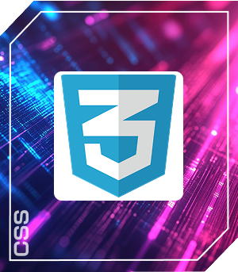
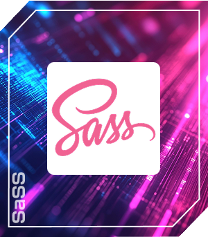
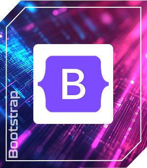
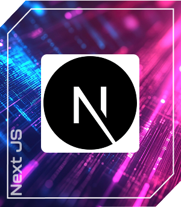
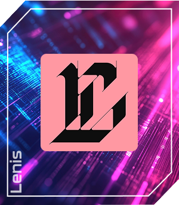
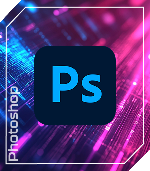
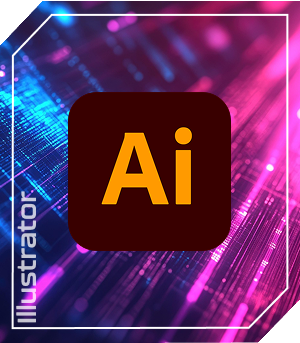

<h1 align="center">Hi, I'm Saifur Rahman</h1>
<h3 align="center">A passionate frontend web developer from Bangladesh</h3>

I'm a frontend web developer. I specialize in 
creating modern website user interfaces that increase user experience and your business success. 
In addition to my professional work, I am passionate about self-learning and staying up-to-date with the 
latest technologies in the development field.

- 🔭 I’m currently working as a **frontend developer.**

- 🌱 I’m currently learning **Next JS**

- 👨‍💻 All of my projects are available at [https://md-saifur-rahman-portfolio.netlify.app/](https://md-saifur-rahman-portfolio.netlify.app/)

- 📄 Know about my experiences [https://mdsaifurrahman-resume.netlify.app/](https://mdsaifurrahman-resume.netlify.app/)

- 📫 Reach me via **saifurrahmansaif954@gmail.com**

<h2 align="left">Technologies that I know : </h2>

  <h3>Languages:</h3>

  

  <!--  -->

  

  

 

<h3>Client side:</h3>

 

 

<!--  -->
<!--  -->
<!--  -->

 

<!--  -->

<!--  -->

<h3 align="left">Server side:</h3>

  

   

<h3 align="left">Database:</h3>

  

  

<h3 align="left">CI / CD:</h3>

<h3 align="left">Authentication:</h3>

<h3 align="left">Designing:</h3>

  

<h3>Others Information:</h3>

 
<h3 align="left">Connect with me:</h3>

